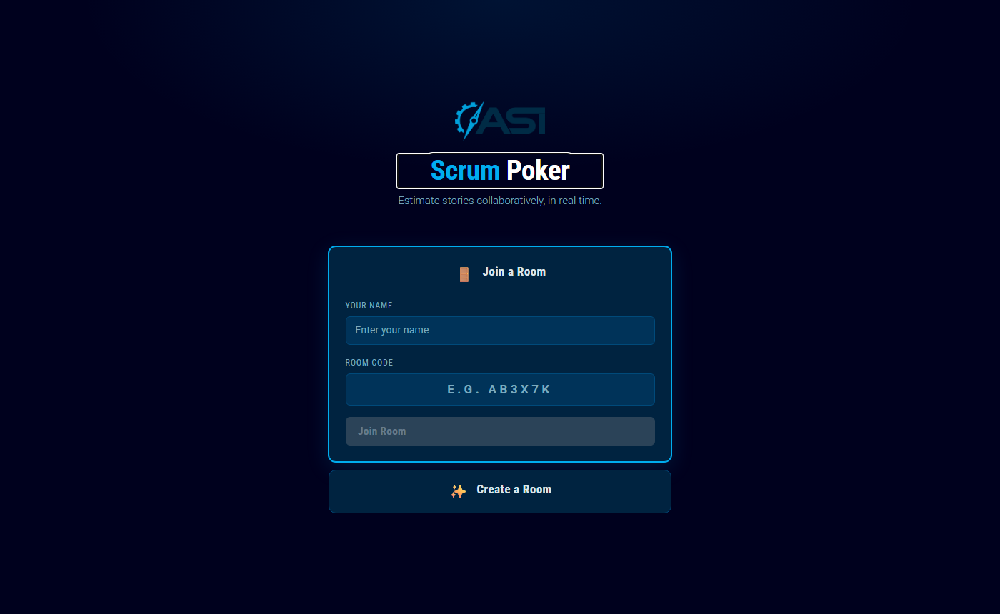
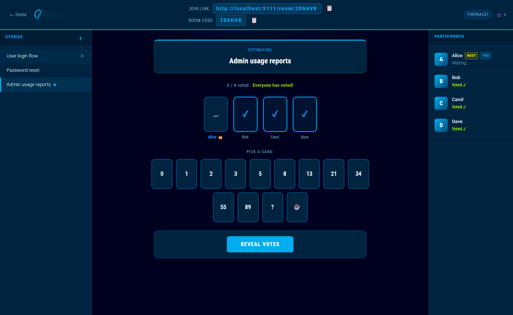
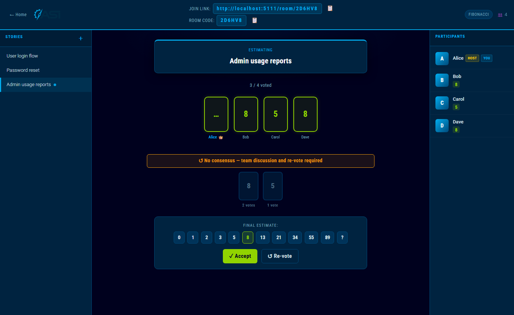
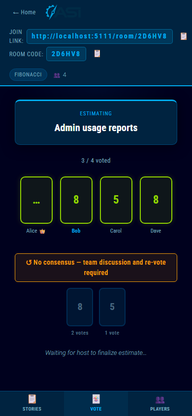

# ASI Scrum Poker

A real-time collaborative story pointing tool built for ASI teams. No account required — create a room, share the link, and start estimating.

## Features

- **Real-time sync** — votes, reveals, and story changes appear instantly for all participants
- **Multiple card decks** — Fibonacci, T-Shirt Sizes, Powers of 2, or fully customized
- **Deck customization** — add, remove, and reorder cards before creating a room
- **Story management** — host can add, remove, and switch between stories; completed stories show their final estimate
- **Vote reveal & consensus detection** — see whether the team agrees at a glance
- **Re-vote** — reset votes for the current story without losing other stories' estimates
- **Host transfer** — host can hand off to another participant; auto-transfers if the host disconnects
- **Mobile-friendly** — tab-based navigation for phones and tablets
- **No install for participants** — join from any browser via a room code or link

## Screenshots

| Home | Voting in Progress | Results Revealed | Mobile |
|------|--------------------|-----------------|--------|
|  |  |  |  |

## Prerequisites

- [.NET 10 SDK](https://dotnet.microsoft.com/download/dotnet/10.0)

Verify your install:
```bash
dotnet --version
# should print 10.x.x
```

## Running Locally

```bash
git clone https://github.com/AndyStetts/ScrumPoker
cd ScrumPoker
dotnet run
```

The app opens at `http://localhost:5111`. Only your machine can reach it at this address.

## Sharing on Your Local Network

To let teammates on the same Wi-Fi or VPN connect, change one line in `Properties/launchSettings.json`:

```json
"applicationUrl": "http://0.0.0.0:5111"
```

Then:

1. Run the app with `dotnet run`
2. Find your machine's local IP:
   ```bash
   # Windows
   ipconfig
   # Look for "IPv4 Address" under your Wi-Fi or Ethernet adapter
   ```
3. Share `http://<your-ip>:5111` with teammates

**Windows Firewall** — if others can't connect, allow the port once in an elevated PowerShell:
```powershell
New-NetFirewallRule -DisplayName "ScrumPoker Dev" -Direction Inbound -Protocol TCP -LocalPort 5111 -Action Allow
```

Remove it when done:
```powershell
Remove-NetFirewallRule -DisplayName "ScrumPoker Dev"
```

## Sharing Publicly (Any Network)

Use [ngrok](https://ngrok.com) to create a public HTTPS tunnel to your laptop — no server required.

```bash
# Install (Windows)
winget install ngrok

# Authenticate once (free account at ngrok.com)
ngrok config add-authtoken <your-token>

# In one terminal: run the app
dotnet run

# In a second terminal: open the tunnel
ngrok http 5111
```

ngrok prints a public URL (e.g. `https://abc123.ngrok-free.app`). Share it with anyone — works across any network or device. The URL changes each time ngrok restarts on the free plan.

## Deploying to Azure App Service

For a persistent deployment that survives laptop restarts:

1. **Publish the app:**
   ```bash
   dotnet publish -c Release -o ./publish
   ```

2. **Create an Azure Web App** — in the Azure Portal:
   - Runtime: `.NET 10`
   - OS: Windows
   - Tier: **Basic B1 or higher** (WebSockets are required for Blazor Server; the free tier does not support them)

3. **Enable WebSockets** — in the app's Configuration → General Settings, set **Web sockets: On**

4. **Deploy:**
   ```bash
   az webapp deploy --resource-group <rg> --name <app-name> --src-path ./publish --type zip
   ```
   Or use the Azure App Service extension in VS Code for a point-and-click deploy.

## How It Works

### Create a Room
Click **Create a Room**, enter your name, choose a card deck (optionally customize which cards to include), and click **Create Room**. You are the host.

### Join a Room
Share the **Join Link** or **Room Code** shown in the room header. Teammates open the link or go to the home page and enter the code.

### Pointing a Story
1. Host adds a story using the **＋** button in the Stories panel
2. All participants pick a card — votes are hidden until revealed
3. Host clicks **Reveal Votes** when ready
4. Results show groupings and whether the team reached consensus
5. Host selects a **Final Estimate** and clicks **✓ Accept** — the story is marked complete and the next story is automatically selected
6. To re-discuss, click **↺ Re-vote**

### Host Controls
| Action | Who |
|--------|-----|
| Add / remove stories | Host only |
| Switch active story | Host only |
| Reveal votes | Host only |
| Accept final estimate | Host only |
| Re-vote | Host only |
| Transfer host to another participant | Host only |

### Host Transfer
- **Manual:** In the Participants panel, hover (desktop) or tap (mobile) a participant's name — a **👑 Make Host** button appears
- **Automatic:** If the host closes their browser or navigates away, the first remaining participant is automatically promoted

## Project Structure

```
ScrumPoker/
├── Components/
│   ├── App.razor             # HTML shell, JS interop helpers
│   ├── Routes.razor
│   └── Pages/
│       ├── Home.razor        # Create / Join room page
│       └── Room.razor        # Main voting UI
├── Models/
│   ├── CardDeck.cs           # Deck types and card lists
│   ├── Participant.cs        # Participant state (name, vote, host flag)
│   ├── Room.cs               # Room state (stories, deck, votes revealed)
│   └── Story.cs              # Story state (votes, final estimate)
├── Services/
│   └── RoomService.cs        # In-memory room store, real-time notifications
├── wwwroot/
│   └── app.css               # All styles
└── Properties/
    └── launchSettings.json   # Dev server config (port 5111, localhost by default)
```

## Notes

- **State is in-memory** — all rooms and votes are lost if the server restarts. This is intentional for a lightweight dev/demo tool.
- **No authentication** — anyone with the room code can join. Rooms are ephemeral and codes are randomly generated.
- **Room limit** — rooms support up to 30 participants.


